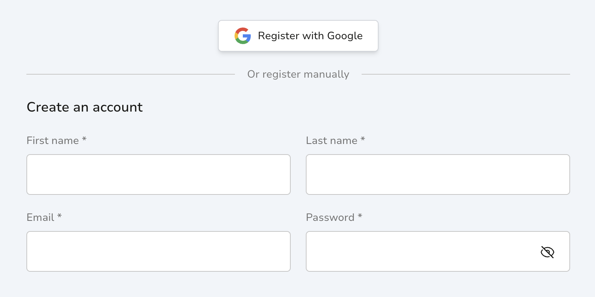
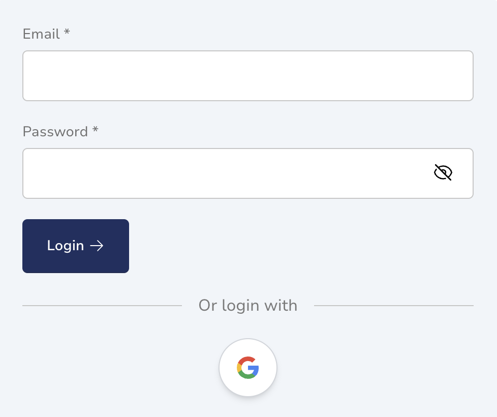
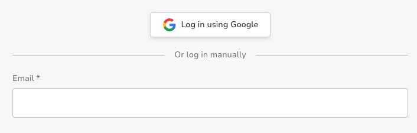

# Rapidez Social Login [PREMIUM]

A Social Login package using [Laravel Socialite](https://laravel.com/docs/socialite) making it possible to login as customer with any OAuth providers Socialite supports including; Google, Apple, Facebook, X, LinkedIn, GitHub, etc.

The packages is ready and used in some Rapidez projects but not open sourced and currently marked as "premium", we do not know yet how, and if, we are going to do things with payed packages. Do you need this package? Contact us and let's talk about the options.

## Examples

Here are some examples with just Google.

### Registration

### Login

### Checkout

